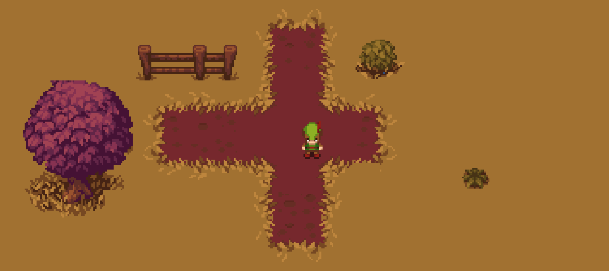

# unity-first-top-down

2D game created in Unity from youtube video "TOP DOWN MOVEMENT in Unity!" by Brackeys.

Link to the Video:

https://www.youtube.com/watch?v=whzomFgjT50

Link To his channel:

https://www.youtube.com/@Brackeys

This game has several small improvements beyond the tutorial as I tried to make it my own.

# Unity Version
2021.3.20f1

---

# LINK TO CHECK THE MOVEMENT
https://rubenftgd.github.io/unity-first-top-down

# CONTROLS
**Keys** - Move UP/Down and Left/Right

**W/S/A/D** - Move UP/Down and Left/Right

---

**Gameplay Screenshots**
======

---

# TO FIX WEB GAME DEPLOY
Go to Player setting -> WebGL -> Publish settings -> Compression = disabled. 
